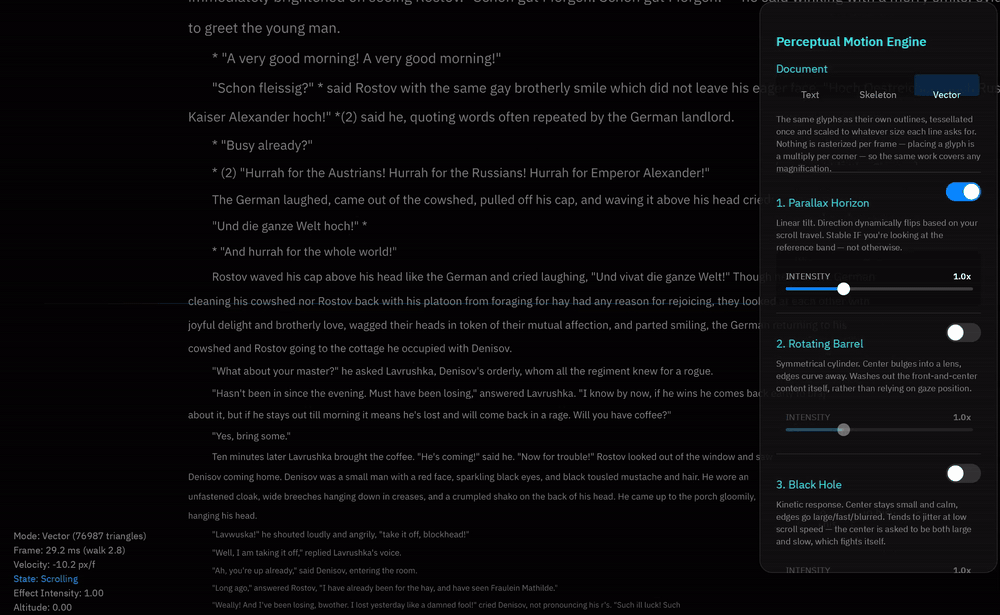

# cool_scroll

A perceptual motion engine for scrolling: five candidate ways of making fast
scrolling feel like less of a fight, drawn over the same text so they can be
compared by eye.

*War and Peace, scrolled with Parallax Horizon armed, in the vector mode. The
readout in the bottom-left is the app's own: 29.3ms for that frame, and 2.9ms of
that spent building the elements.*

## What this is

A desktop app you scroll. Arm one of five effects in the panel on the right, then
move the document with a wheel, a trackpad, or a drag. Each effect is a perceptual
transform applied to the document as it moves — the text tilts, bulges, shrinks or
fades out of your way — and the question behind all of them is what fast scrolling
should *look* like when it stops fighting your hand.

The panel's first control is not one of the effects. It chooses how the document is
*painted*, and that turned out to matter as much as the effects do: the same text in
the same window can cost an order of magnitude more to draw in one of its three
modes than in another.

## Quickstart

    git clone https://github.com/bite-gpui/bite_gpui_scroll_demo.git cool_scroll
    cd cool_scroll
    git clone --branch bite_v1.21.0-pre-path-pass-cost https://github.com/bite-gpui/bite-gpui.git bite-gpui
    cargo run --release

The second clone lands *inside* the app's directory, and it is not optional:
`Cargo.toml` takes GPUI from `bite-gpui/` by path, so nothing builds without it. The
branch is this app's own work on top of `bite_v1.21.0-pre`, the fork's version line
for GPUI 1.21 — which is the part of the branch name that matters, since the fork
keeps a line per version — and the four commits it carries are described under
**`bite-gpui/`** below.

The toolchain is pinned to the fork's (`rust-toolchain.toml`), and the first build
compiles the whole GPUI stack, so give it a couple of minutes — several more for a
release build. Release is worth it: this is a motion demo, and in a debug build most
of each frame goes on laying out and shaping the lines on screen.

## What it is built on

[**bite-gpui**](https://bite-gpui.github.io/) — *stop forking, start swapping* — a
modular re-architecture of GPUI, its stack split into five crates (`gpui_types`,
`gpui_engine`, `gpui_platform`, `gpui_authoring`, `gpui_runtime`) under the familiar
`gpui` facade, so that a layer can be replaced on its own rather than the whole thing
forked. Its architecture, crate layout and benchmarks are on that site. It is not
affiliated with upstream GPUI or Zed.

This app is the facade, plus two of the swaps it is built for:

- **A text system**: Parley for shaping and measuring, Skrifa for glyph outlines,
  tiny-skia for their coverage — installed with `application().with_text_system(...)`
  from this repository's copy of the fork's `gpui_parley`.
- **A frame pipeline**: the fork's `ThrottledPipeline`, which `FRAME_CAP` arms.

## The five effects

- **1. Parallax Horizon**, **2. Rotating Barrel** and **3. Black Hole** are
  distortion fields: they trade legibility for a sense of travel.
- **4. Kinetic Fading** washes out whatever is currently large and fast.
- **5. Altitude** sidesteps the problem instead, shrinking the document the way
  ground recedes from a plane. It is mutually exclusive with the others.

## The three modes

The selector decides how the document is painted. All three modes draw the same
lines:

- **Text** sets every line at the size the transform asks for, and that size stays
  *exact*: every glyph's position, and the width of the line, is what the transform
  asked for. What is rounded is the size the renderer *cuts* a glyph at, because that
  is the size it caches a glyph by — and a size that changes every frame asks for a
  fresh cut of every glyph of every line of every frame, and is never asked for
  anything the atlas already holds. Rounding there is worth 37.6ms a frame of
  scrolling against 13.9ms, most of what is left being the layout, which a line drawn
  at a new size does have to be laid out for again.
- **Skeleton** draws every line as bars instead of setting its text — the same
  document, since a bar is as wide as the word it stands in for. A bar is a quad,
  so nothing is shaped or rasterized at all.
- **Vector** draws the glyphs' own outlines: each one tessellated into triangles
  once, then scaled to whatever size each line asks for. Nothing is rasterized
  per frame either — placing a glyph is a multiply per corner of its triangles —
  so the same work covers any magnification. The readout says how many triangles
  that came to for the frame.

The three are for comparing what a scroll *feels* like when the text stops being
the bottleneck: switching modes changes nothing about the motion.

## Layout

    src/           the app
    assets/        the corpus, the fonts the text system can be set in, and the demo clip
    patches/       local copies of crates the fork cannot be used for as-is
    bite-gpui/     the GPUI fork this builds against

**`src/`**

- `main.rs` — the view, the controls panel, the line layout, the entry point.
- `motion.rs` — scroll physics and the perceptual transform: the document's
  position is a `gpui_animotion` property (a wheel tick tweens it, a drag springs
  it, letting go flings it, grabbing stops it) and every effect is a multiplier
  on one scale, while the simulation counts in 60fps frames so its feel survives
  a display that refreshes faster. Documented in depth in the file.
- `document.rs` — parses the corpus into paragraphs and wraps them into the lines
  the engine walks. A line also remembers how wide each of its words is, which is
  what the skeleton mode draws its bars from.

**The text** is `assets/war-and-peace.txt`, read at startup. Paragraphs are
separated by blank lines, short lines opening with `CHAPTER`/`PART`/`BOOK` are
set as headings, and each paragraph is wrapped to an 800px column. Wrapping needs
text measurement, so the document is built on the first frame rather than in the
constructor; `document::MAX_LINES` caps how much of the book is taken (the whole
thing is ~90,000 lines, and the cost is linear in the text). Point
`load_corpus` at another file to scroll through something else.

The measuring and the rendering both go through Parley — Skrifa for the glyph
outlines, tiny-skia for their coverage — because `main` installs a copy of the
fork's `gpui_parley` with `application().with_text_system(...)`. Worth knowing
what that crate is: it compiles in IBM Plex Sans and takes any other font the app
hands it, shaping and rasterizing from the shaper's own font database, so a font is
tried by dropping it under `assets/fonts/` and naming it:

    COOL_SCROLL_FONT="Liberation Serif" cargo run --release

A face's family, weight and slant are read out of the font itself, so nothing has
to be told what a file is, and a name nothing was loaded for falls back to the
compiled-in family rather than drawing nothing. That is enough to see what these
effects read like in a serif, or a mono, or whatever is to hand. It exists to prove
GPUI's text SPI can be implemented out of tree, not to be a general text stack —
which is why it lives in `patches/` as a copy, rather than being depended on where
it is.

The **vector** mode is the other route through the same crate: Parley lays the
line out, then `ParleyTextSystem::glyph_triangles` tessellates a glyph's outline
into triangles in em units, and the app scales those per line and pushes them
through `Window::paint_path`. So a frame of text is a multiply per corner of a
cached triangle and nothing is rasterized at all. The tessellations are cached
per glyph and per power-of-two size band, which is what keeps one outline serving
every size a line is drawn at.

The document's position is a `gpui_animotion` property — one of the crate's
interruptible `Prop`s — rather than a simulation of its own, and every way of
moving it is one of that crate's segments: a wheel tick tweens to the accumulated
target, a pointer move re-aims a spring, letting go of a drag hands the pointer's
velocity to a kinetic flick, and taking hold stops it dead. What `motion.rs`
simulates is everything the prototype layered on top of position: the blend that
switches the effects on, the altitude the document climbs, and the direction it
is tilting.

The window asks for a frame only while something is moving, and animations are
unmounted or dropped once they have settled, so the app goes quiet at rest. The
panel's transitions (the switch knob, and controls dimming as they are armed)
come from `gpui_animotion` as well.

**`bite-gpui/`** is a checkout of `bite-gpui/bite-gpui`, on the branch
**`bite_v1.21.0-pre-path-pass-cost`** — this repository's four commits, branched from
the tip of the fork's `bite_v1.21.0-pre` (`7be9200`), its version line for GPUI 1.21.
They are meant for the fork rather than for here, and each stands on its own:

- `ZED_PATH_SAMPLE_COUNT`, a knob for measuring what the vector path pass's
  multisampling costs;
- `ZED_PATH_DIRECT`, the saving that knob made visible: with nothing to resolve, the
  pass draws straight into the frame instead of into a target the size of the window
  and compositing it back;
- the per-corner `ContentMask` a `PathVertex` has carried since before the renderers
  stopped reading it, dropped — which halves the vertex, along with the vendored copy
  of `scene.rs` the Apple build script hands to cbindgen;
- the size a glyph is *rasterized* at rounded onto a lattice, while the size it is
  *laid out* at stays exact — which is the difference between 37.6ms and 13.9ms of a
  scrolling frame in the text mode above.

The first two are in `gpui_wgpu`, the third in `gpui_engine` and `gpui_apple`'s
vendored copy of it, the fourth in `gpui_authoring`. The branch is pushed, so there
is nothing to do to it but open it:

    https://github.com/bite-gpui/bite-gpui/pull/new/bite_v1.21.0-pre-path-pass-cost

The checkout sits on that branch, so `git status` there is clean and each commit is
independently buildable — the second is the one to stop at if the knob is not
wanted. It is a dependency rather than a workspace member, so it can also be
replaced by a `git` dependency (see the comment in `Cargo.toml`) or built against a
local edit, without anything of the app's riding along.

**`patches/`** holds local copies of the three crates this app cannot take as
they come: a shim that resolves the published `gpui-unofficial` to the fork's
`gpui`, `gpui_animotion` with the one `Element` signature adapted to the fork's
trait, and `gpui_parley` — which the app *uses* rather than patches, and keeps
here so that changing it is possible. See `patches/README.md`.

## What a frame costs

The readout in the bottom-left says where a frame goes: `Frame:` is the interval
between one frame and the next, which is what the display actually got, and
`walk` is the share of it this app spent building the document's elements. A
frame whose interval is far larger than its walk is one being paid for
downstream — by glyph rasterization in the text mode, or by the GPU in the vector
mode. `patches/gpui_parley`'s `frame_cost` example measures the vector mode's own
CPU share directly:

    cargo run --release -p gpui_parley --example frame_cost

**The vector mode's GPU cost is the one to look at first, because it is the one
the other two modes do not have.** Text is drawn as sprites and bars as quads,
both straight into the frame; a path is rasterized into a target *the size of the
window*, resolved, and composited back, so what the path pass costs is mostly
independent of what the paths cover — a screenful of outlines or one progress
ring, the same. At 4x samples on a 2560x1600 drawable that is 64MB of samples to
clear and read back every frame, against a few hundred kilobytes of quads. Two
knobs this repository added to the fork's `gpui_wgpu`, alongside its own
`ZED_FONTS_*` ones, are how to see what that costs:

    ZED_PATH_SAMPLE_COUNT=1 cargo run --release    # no multisampling: cheapest, jaggier edges
    ZED_PATH_SAMPLE_COUNT=2 cargo run --release    # half the samples
    ZED_PATH_DIRECT=0 cargo run --release          # rasterize into the target and composite it

With no multisampling there is nothing to resolve, so `ZED_PATH_DIRECT` stops
being an optimization and becomes an outright saving: the target exists only as a
resolve target, and without one it is two window-sized passes — a clear and a
composite — for whatever the paths cover. The rasterization pipeline already
blends into a surface-format target, so the paths are drawn straight into the
frame instead, where their batch sits in the frame's order. `ZED_PATH_DIRECT=0`
puts the intermediate back, which is what to do if the paths look wrong rather
than merely jaggy.

The frame rate is *not* capped by default. `FRAME_CAP` in `main.rs` caps it
through the fork's `ThrottledPipeline` (`Some(30)` and the app draws at 30
frames a second while the document moves). The motion is time-based rather than
frame-based, so a cap changes nothing about what a scroll looks like — only how
many frames it is made of, and therefore what watching one costs. It buys
steadiness at a lower rate, and nothing at all when the frames themselves are
what is expensive, which is why it is off.

## Tests

    cargo test                            # the engine's own tests
    cargo test --features test-support    # ...and the view's, on a headless window

Neither half needs a display, but only the second needs a window.

`document.rs` has unit tests for parsing, wrapping and the word widths the
skeleton mode needs, measured with a stick of 40px per character rather than a
text system. `motion.rs` has unit tests for the physics: a wheel tick settling on
its target, a flick landing where its decay says it will, a flick into an end
coming to rest on it, a tick turning a flick around mid-flight, altitude climbing
with speed and falling more slowly, and the mutual exclusion between Altitude and
the distortion fields.

The view's tests live in `main.rs` and drive a real window on the headless
platform, which is `gpui`'s `test-support`: the document is walked and the wheel
moves it in the right direction (and the walk finds the same lines in all three
modes), a wheel over the panel leaves the document alone, a switch springs its
knob across and settles (which exercises the patched animotion element end to
end), the selector repaints the document as bars and back to text, the vector
mode places triangles for a screenful and shapes each line once rather than once
a frame, a drag throws the document past where the pointer asked it to be,
grabbing calls off a flick in flight, the frame rate cap really is on the
window's pipeline (a frame asked for inside the cap is deferred, one asked for
past it is drawn), the corpus loads, parses and wraps, and the app really is
shaping its text through Parley.

Two of those draw the document as skeleton bars rather than as text. They are
testing the pointer, and a pointer's speed is measured in wall-clock time: the
flick a release throws is built from samples taken within a fifth of a second of
it, and the harness draws a frame between two events. A debug build spends about
half a second on a screenful of *magnified* text — which a flick has in it — so
every sample but the last would fall outside that window and the flick would be
measured as no movement at all, leaving the tests to pass or fail on how fast the
machine is. Bars cost the same at any magnification.

Where those numbers come from is measurable rather than folklore. One test prints
them instead of asserting, and is skipped unless asked for:

    cargo test --features test-support -- --ignored --nocapture a_frame

It draws a frame per mode, at rest and with a flick in flight, and reports the
interval and the walk for each. On a debug build of this repository that comes
out as about 25ms and 0.1ms for text at rest, 558ms for text mid-flick, 25ms for
bars either way, and 30ms with a 6.4ms walk for vectors.

That feature is declared by this crate rather than left in `[dev-dependencies]`
because a dev-dependency's features are unified into every dev-context build:
`test-support` moves gpui's frame drawing onto a path that draws every dirty
window at the end of every `App::update` instead of leaving frames to the
platform, so a build that is not running tests should not be able to pick it up
by accident. The same reasoning is written out at length in the manifest of
`patches/gpui_parley`, whose example would render once per input event if it
ever saw this feature.

The vendored text system has tests of its own:

    cargo test -p gpui_parley                          # shaping, rasterization, its caches
    cargo test -p gpui_parley --features test-support  # ...and that it can be injected
